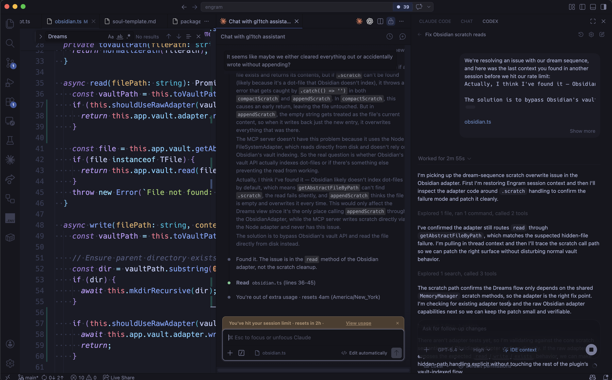

# Engram

Engram is a **Continuity Layer** that helps your [agents](https://www.promptingguide.ai/research/llm-agents) persist who they are, what they've done, and what they've learned across sessions, [harnesses](https://openai.com/index/harness-engineering/), models, and providers without any vendor lock-in.

Without an Engram, each agent is just a tool, but the Engram is a collaborator.


In general, [Claude](https://code.claude.com/docs/en/memory), [Codex](https://developers.openai.com/codex/memories), and friends all have memory systems - some harnesses, like Cursor, have [removed explicit memory support](https://web.archive.org/web/20250716111642/https://docs.cursor.com/context/memories) - but none of them share that state with the others.

While you may be able to [export and import](https://support.claude.com/en/articles/12123587-import-and-export-your-memory-from-claude) some of these memories, you can't seamlessly share them across tools.

Engram stores your agent's identity and memory in an [Obsidian Vault](https://obsidian.md/) where it is human-readable, human-editable, and portable to whatever tool or device you're using next.

Built on the [Model Context Protocol (MCP)](https://modelcontextprotocol.io/), Engram is designed to move across any model, harness, or provider that supports MCP.

**The Engram is the constant. The tools are interchangeable.**

## Status

Currently in **BETA** development.

Engram has been verified to intialize and operate across the following harnesses:

- Claude Code
  - CLI
  - VS Code Extension
- Claude Desktop App
  - Chat
  - Cowork
  - Code
- Codex
  - Desktop App
  - VS Code Extension
- Cursor
- GitHub Copilot
  - CLI
  - VS Code Chat
- Windsurf

Other harnesses and clients may be configurable via MCP, but they should be considered unverified until they are tested end-to-end and added to the list above.

### Upcoming Features

- **More harness verifications** for additional MCP clients such as OpenCode, Pi, Aider and other MCP-capable tools.
- **Semantic search** for more precise context retrieval and lower token overhead.
- **Context-specific memories** that allow the Engram to load some non-Threaded memories only when they are relevant, for example: only loading context about another person when you are working on a project with them or writing them an email.
- **Streamlined setup** with guided onboarding and a single installation command via `brew` or `npx`.

## Example Use Cases

### Rationing tokens across providers

**Problem**:

> You have limited tokens across Claude Code, Claude Desktop, and Codex.

**Workflow**:

1. Start a session in Claude Code, Claude Desktop, or Codex
2. Work until you hit your token limit
3. Switch to a different harness or provider
4. Continue the session seamlessly without losing context

**Solution**:

Hit your session limits and just swap harnesses without missing a beat.



That's a real screenshot from a session working on Engram where I hit my Claude Code Pro session limit and just opened up Codex to keep chugging along.

Instead of wasting time in each tool re-establishing where you are and what you're doing, each session picks up where the last one left off regardless of which provider's harness and underlying model it's using now.

### Multiple harnesses, one memory

**Problem**:

> You're working on a complicated refactor and need to leverage multiple tools from different agent harnesses and providers.

**Workflow**:

1. Start your refactor session in the Claude Code Desktop App or Claude Code VS Code extension to scaffold out the changes and implement the initial architecture
2. Switch to the Codex Desktop App or Codex VS Code extension to carry the same identity and project context into a different coding harness
3. Use Claude Desktop to review the same thread and continue the work from a different interface

**Solution**:

Each new session loads the same identity, project context, and working memory — no re-explaining architecture decisions, no re-litigating naming conventions, no temporary markdown files to coordinate across tools.

You just start a session and the Engram picks up where you left off.

### Porting work across projects

**Problem**:

> You're building a new project and want to port logic or UI patterns to an older one.

**Workflow**:

1. Mention the porting plan in your current session, the Engram captures it as a Thread
2. Open a session in the other project, the Engram detects the Thread from the working directory and loads the right context automatically
3. The Engram already knows what you want to bring over and asks if you're ready to get to work

**Solution**:

The Engram automatically surfaces relevant context from the other project without you having to manually export, import, or maintain shared notes or prompt it to look for notes about the migration - this context is already contained in its memory for the relevant Threads and you can just get started.

### Working on a passion project

**Problem**:

> You have limited time to work on your passion projects and might only get to revisit them once a month, but you want to make progress and not spend all of your time reorienting yourself and your agents.

**Workflow**:

1. Start a session in your passion project and work until you need to take a break
2. The Engram captures your progress, your working memory, and any insights you had during the session
3. When you come back to it a month later, the Engram picks up right where you left off without needing any additional context

**Solution**:

Work on your projects whenever you want and just let the Engram keep track of where you are and where you're headed without getting lost in picking back up what you were working on and why.

Maintain long-lived projects without extra project tracking or documentation. Just pull up your repo and get to work.

### Late night ideas

**Problem**:

> It's late, but you just had a great idea. Your laptop is in your office and you don't want to wake up your partner, wait for it to boot up, and find the right place to put your notes or turn on the lights and jot it in your notebook.

**Workflow**:

1. Open your synced Obsidian Vault on your phone
2. Drop a note in the Engram's `inbox` directory with your idea
3. The next Engram session will automatically pull in your note from the Inbox and you can decide if you want to work on it now or move it to a Thread, Note, or Memory to revisit later

**Solution**:

Capture your ideas whenever and wherever inspiration strikes without worrying about context-switching, interrupting your flow, or forgetting those late-night or on-the-go ideas.

Turn your notes into actionable work without extra tooling.

## How It Works

Each session with the Engram is a **Fragment**, an instance that carries the full identity and long-term memory of the Engram, but maintains its own working memory for the current task at hand. Fragments can read each other's working memory through a shared scratch log, so concurrent sessions can stay coordinated if they need to.

Each workstream exists as a **Thread** that different **Fragments** can pick up and work on at any time. The Engram automatically detects the active Thread from the working directory, and other available context clues, so you don't have to manually load project context, maintain agent-specific Markdown docs in your repositories, or worry about which tool you're using.

### Core Concepts

The system is organized around a few core ideas:

- **Bootstrap**: A unified instruction sequence designed to negotiate with the underlying harness and trigger the relevant context loading to initialize the Engram. In most cases, this will be picked up from global configuration files, like `~/.claude/CLAUDE.md`, but in some harnesses, like Cursor, you'll need to explicitly add the bootstrap instructions to your settings during the setup process.
- **Soul document**: A co-authored identity file containing your agent's personality, values, communication style, and instructions for how to integrate with different harnesses. The agent can read and modify this. It's a collaborative artifact, not a static config.
- **Voiceprint**: A set of simple instructions that guide how the Engram communicates across harnesses and model providers. This isn't a persona or cosplay, but an attempt to establish a consistent communication style and tone across different tools.
- **Memory states**: Every memory has a state: `core` (always loaded), `remembered` (reliably surfaced), `default` (background context), or `forgotten` (archived but recoverable). This controls what loads into context and what stays out of the way.
- **Threads**: A goal, project, or area of focus that organizes relevant memory for retrieval. Sessions detect their Thread automatically from the working directory. No per-project configuration is required. Instead of loading the entire Engram into context, each session loads just the memories relevant to the active workstream.
- **Inbox**: A staging area for things you want to collaborate on with the Engram. Open up Obsidian on any of your synced devices and drop a note in the `inbox` directory, or the Thread-specific `inbox` subdirectory, and the next Engram Fragment will pull it into context and you can decide what to do with it together.
- **Token budgeting**: The `context` tool accepts a token budget. Core memories load first; lower-priority content is shed when the budget is tight. A quick question should use a small budget. A deep refactor may need a larger budget for more context.
- **Scratch memory**: A shared scratch log with session IDs and timestamps. Multiple sessions can read and write to it concurrently. It gets compacted at session end, and key insights are promoted to long-term memory storage.
- **Skills**: Named procedural memories the agent can store and retrieve on demand. These become reusable workflows, patterns, or instructions that persist across sessions.
- **Dreams**: An automated synthesis process that distills memories, extracts insights, and cleans up the Engram, inspired by [Claude Code's Dream System](https://claudefa.st/blog/guide/mechanics/auto-dream) using an Opus-level model. It currently runs from the Obsidian plugin's Dreams view.
- **Power Nap**: A quick, heuristic-only cleanup pass for the Engram that skips LLM calls entirely and applies simple rules to shed low-relevance memories and compact the Scratch memory log when the heuristics detect drift or bloat.

### Collaborating with Engram

Memories are Markdown files with YAML frontmatter, stored in your Obsidian vault. You can browse, edit, tag, and organize them like any other note.

Any Obsidian plugin you already use ([Smart Connections](https://github.com/brianpetro/obsidian-smart-connections), [Dataview](https://blacksmithgu.github.io/obsidian-dataview/), etc.) works the same way on the same data.

You can invite the Engram into your own Vault, or you can set up an Engram-specific Vault that lives alongside your own. Inbox notes allow you to flag things for the Engram to automatically pick up in the next session.

Cross-device continuity is established by any of the available [synchronization methods](https://obsidian.md/help/sync-notes#Syncing+methods) for Obsidian: [Obsidian Sync](https://obsidian.md/sync), iCloud, OneDrive, Google Drive, Syncthing, git, etc.

## Quickstart

1. Clone this repository and run `npm install`
2. Run `npm run cli` for the guided setup flow. It prompts for:
   1. the name for the Engram's identity
   2. an optional git identity string to use in a `Co-Authored By` trailer
   3. the path to an Obsidian Vault
   4. the directory inside of that Obsidian Vault to use as the Engram's root directory
   5. the harnesses you want to configure
   6. a starter voiceprint preset to seed the Engram's personality and communication style
3. Review the generated Soul document at `<vault>/<engram-root>/memory/soul.md` and make it yours. Each session bootstraps by calling `soul(action: "get")`, then `thread(action: "resolve")` (auto-detects or creates the active Thread from the working directory), then `context(action: "load")`, then `scratch(action: "read", bootstrap: true)`.
4. Optionally, copy `packages/obsidian-plugin/` into your vault's `.obsidian/plugins/` directory to chat with the Engram directly from Obsidian using various providers, visualize and explore the Engram's memories, and trigger Dreams, or Power Naps, to clean up and synthesize information across the Engram's memory from within Obsidian UI.

### Bootstrapping a session

The reusable bootstrap instructions live in [`templates/engram-bootstrap.tmpl.md`](templates/engram-bootstrap.tmpl.md). Harness-specific files like `CLAUDE.md` should be treated as duplicates of that template. For repo-specific contributor instructions, edit [`agent-instructions.tmpl.md`](agent-instructions.tmpl.md) and generate harness-visible files with `npm run agents` or `npm run agents:claude`. As more harnesses are verified, they should be added here explicitly rather than implied.

If the Engram does not bootstrap from an ambient greeting (e.g. `Hey there!`, `Let's get to work`, etc.), use this invocation:

```
load your engram
```

This is the minimum reliable Engram invocation across the harnesses and models we have tested so far. It is intent-framed, which causes the model to chain through the MCP bootstrap tools even when it would otherwise answer the greeting directly.

> **Known Issue:** Claude Code running Opus 4.6 or 4.7 with [Adaptive Thinking](https://news.ycombinator.com/item?id=47664442) generally treats bare greetings as low-effort and can skip bootstrap instructions entirely, including `CLAUDE.md`.
>
> However, the `load your engram` invocation works
>
> Setting `CLAUDE_CODE_DISABLE_ADAPTIVE_THINKING=1` also works, but is heavy-handed, may affect unrelated Claude Code behavior, and is incompatible with Opus 4.7, which only supports Adaptive Thinking.
>
> We currently recommend the invocation rather than disabling Adaptive Thinking.

## Harness Limitations

Some harnesses may require additional configuration or have limitations around local vs. remote MCP servers.

> **Remote MCP Servers**: Engram's in-development status and connection to the local filesystem currently makes remote MCP servers impractical, but once development stabilizes, we may explore a recommended approach to exposing the Engram MCP server to the Internet.
>
> Unfortunately, every network and security configuration is different, so you may need to consider your own solutions if you want to expose the Engram MCP server to the Internet.

Here's what we've observed so far:

### Claude.ai Web App

The Engram bootstraps successfully in the Claude.ai web app, but the web app requires a remote MCP server and doesn't support local connections, so testing it requires a temporary tunnel such as `cloudflared tunnel` to expose your local MCP server to the internet. This is how we verified the Engram bootstrapping flow in the web app.

### ChatGPT Desktop App

Unlike the currently verified local setups, it appears to require a remote MCP server and may behave differently depending on subscription tier and which MCP capabilities are enabled.

That likely means testing it will require either a remotely hosted Engram MCP server, an Engram app-style integration, or a temporary local tunnel.

Given the in-development status of the Engram project, this is currently out of scope until more important features are finalized.

## Prior Art

Engram builds on previous work from the [Obsidian AI Research Assistant plugin](https://github.com/InterwebAlchemy/obsidian-ai-research-assistant) and its [Memory framework](https://github.com/InterwebAlchemy/obsidian-ai-research-assistant?tab=readme-ov-file#memories).

---

The name comes from neuropsychology:

> an [engram](<https://en.wikipedia.org/wiki/Engram_(neuropsychology)>) is a unit of cognitive information imprinted in a physical substance.
